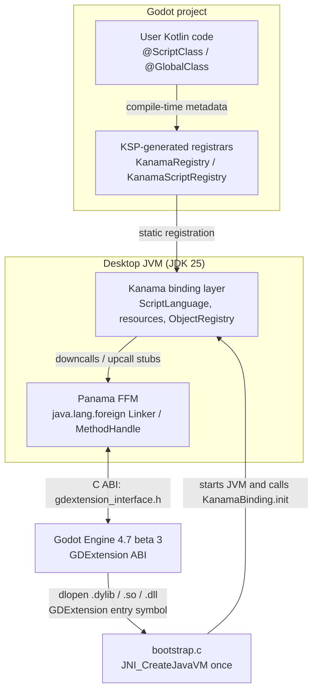
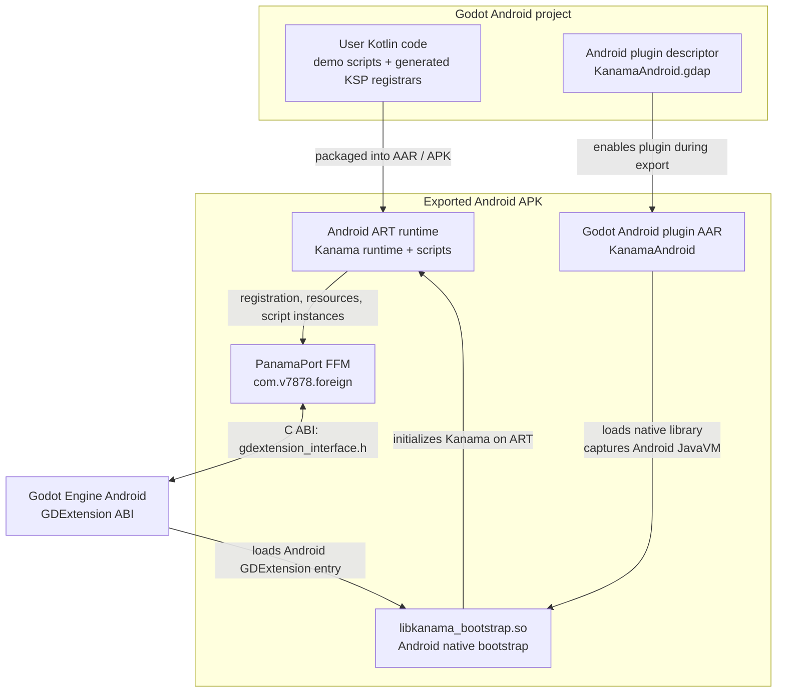
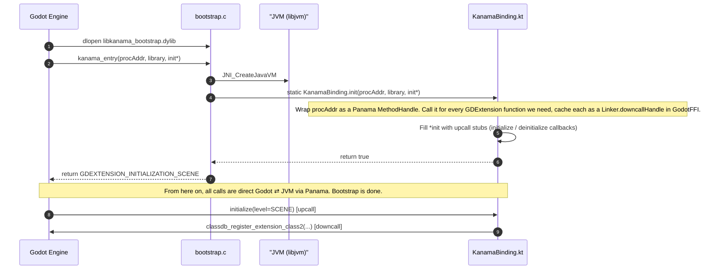
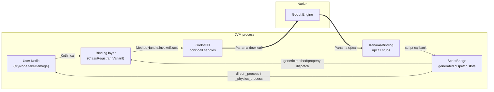

# Architecture

How the pieces fit together.

## The runtime layers

Desktop and Android share the same high-level Kanama model: Kotlin user code is
registered through generated metadata, the binding layer implements Godot's
script/resource contracts, and an FFM layer calls the GDExtension ABI. The
platform split is the runtime underneath that FFM layer.

### Desktop



On desktop, everything above `bootstrap.c` is JVM bytecode. Everything below is
Godot. The native bootstrap exists *only* because Godot loads a native
`.dylib`/`.so`/`.dll` and we need somewhere to call `JNI_CreateJavaVM` from.
After that one call, all boundary crossings happen through Panama
`MethodHandle`s, not JNI.

### Android



Android does not embed a desktop JDK. The exported game runs on Android ART and
uses [PanamaPort](https://github.com/vova7878/PanamaPort) as the FFM layer. The
Android plugin AAR packages the native bootstrap, Kanama runtime, project
scripts, and generated registrars so Godot can initialize the same script
language/resource-loader model inside the APK.

## Initialization (one-time, when Godot loads us)



Key points:

- **`bootstrap.c` runs once and stops.** It does not stay in the call path.
  After step 6 the C frame returns and is never re-entered.
- **The proc-address getter is the only thing C hands to Kotlin.** A single
  `long`. Everything else Kotlin needs, it asks for itself via that getter.
- **Class registration happens during the `initialize` upcall**, not during
  `bootstrap.c`. Godot calls us back when it's ready for us to register —
  we don't push.

## Runtime crossings

Two directions, both via Panama, each with its own mechanism:



- **Downcalls (JVM → Godot)** — `Linker.downcallHandle(addr, descriptor)`
  produces a `MethodHandle` the JIT can inline through. Used for everything:
  `classdb_register_extension_class2`, `object_method_bind_call`,
  `variant_new_copy`, etc.
- **Upcalls (Godot → JVM)** — `Linker.upcallStub(handle, descriptor, arena)`
  produces a function pointer that, when called from C, lands inside a JVM
  method. Used for: lifecycle callbacks (`initialize`, `deinitialize`),
  per-instance virtual dispatch (`_ready`, `_process`), and class create/free
  hooks.

Hot runtime paths keep the same ABI but avoid unnecessary JVM-side work:

- KSP-generated script registrars provide direct lambdas for `_process(delta)`
  and `_physics_process(delta)`. `ScriptBridge.call_func` checks those slots
  before the generic StringName `when` dispatch, so frame callbacks still enter
  through Godot's ScriptInstance vtable but skip the generated method switch.
- `ObjectRegistry` keeps the monotonic handle map as the source of truth and
  mirrors dense low handles into an atomic array. ScriptInstance callbacks use
  the array for the common handle range and fall back to the map for oversized
  handles, preserving handle `0` invalidity and unregister cleanup semantics.
- `ObjectCalls` uses small thread-local scratch buffers for selected high-rate
  ptrcall shapes, such as scalar `float`, `Vector2`, and draw-texture calls.
  These buffers are ordinary FFM `MemorySegment`s reused by the current JVM
  thread, replacing fresh `Arena.ofConfined()` allocations for calls that do
  not retain argument memory after the ptrcall returns.
- Typed object-array decoders can wrap elements directly as the requested
  type. For example, `Array[Node]` results no longer need a temporary
  `GodotObject` wrapper for each element before becoming `Node`.

The scratch buffers are a per-thread cache of tiny native argument/return
slots, not a cache of Godot objects or Variant values. A ptrcall wrapper may use
them only when the call is synchronous and Godot consumes the argument memory
before returning. If Godot can retain the memory, the wrapper must still use an
owned arena with the correct lifetime.

For real demo hot paths, separate downcall-heavy code from callback-heavy code
before adding more helpers. Scratch buffers are most useful when Kotlin is
calling many small Godot methods each frame, such as viewport, transform, input,
or draw calls. If profiling points at repeated Godot→JVM ScriptInstance
callbacks instead, the larger win is usually to reduce callback count, batch
state on a parent script, or move repeated queries out of per-node callbacks;
the registry and dispatch fast paths only run after the FFM upcall boundary has
already been crossed.

**Where JNI shows up — and where it doesn't.** Panama (FFM) handles the
JVM→native direction beautifully, but it has no story for *creating* a JVM
from C in the first place. So `bootstrap.c` makes exactly three JNI
Invocation API calls, once, during startup:

1. `JNI_CreateJavaVM` — bring a JVM into existence inside Godot's process
2. `FindClass("KanamaBinding")` — locate the Kotlin entry point
3. `CallStaticVoidMethod(init)` — hand off control

The moment that `init` call returns, JNI is done. Forever. No
`RegisterNatives`, no further `FindClass`, no more JNI in any call path.
From that point on, Godot ⇄ JVM traffic is *only* Panama: `downcallHandle`
for JVM→Godot calls and `upcallStub` for Godot→JVM callbacks.

The only way to eliminate even those three JNI calls would be GraalVM
native-image (AOT-compile Kotlin to a native library that exports real C
symbols). That's a different runtime — no JIT, no hot reload — and explicitly
not the path Kanama is taking.

## FFM Scalar Precision

Godot uses two related but different floating-point layouts at the FFM
boundary:

- **Value-type components** use `real_t`. `Vector2`, `Vector3`, `Basis`,
  `Transform3D`, and similar built-ins use the generated `GodotReal` layout:
  `Float` for normal single-precision Godot builds, and `Double` for future
  `precision=double` builds.
- **Scalar `float` method parameters and return values** use the Variant float
  ABI slot, which is 64-bit. In `ObjectCalls`, helpers for scalar method
  arguments named `float` must allocate/read `JAVA_DOUBLE`, not `JAVA_FLOAT`.
- **`Color` components** remain fixed 32-bit floats. Color is not `real_t`.

This distinction matters because Godot API docs and `extension_api.json` call
both scalar method values and value-type components "float". Wrapper work must
check the ABI shape, not only the display name. `JAVA_FLOAT` in
`ObjectCalls.kt` should be limited to fixed 32-bit component storage such as
`Color`, while scalar method `float` helpers should use `JAVA_DOUBLE`.

## Object lifetime

Godot is reference-counted on the native side. A Godot object can be freed
the moment its refcount drops to zero — which can happen on any thread, at
any time, while a JVM-side wrapper still holds a reference to its raw
pointer. Touching that pointer after free is undefined behaviour.

The defence is **one `Arena.ofShared()` per Godot object**:

```
Godot creates instance
  → Kanama allocates Arena.ofShared()
  → ObjectRegistry maps instanceId → (Arena, JVM wrapper)
  → All MemorySegments for this object are allocated in its arena

Godot frees instance (refcount → 0)
  → free_instance upcall fires
  → ObjectRegistry.release(instanceId)
  → Arena.close()
  → Any subsequent MemorySegment access throws IllegalStateException
```

This is the single most important reason to use Panama instead of raw JNI:
`Arena` gives us **deterministic, scoped invalidation of every pointer
derived from a freed object**, with no cooperation needed from the user code
or the GC. Use-after-free becomes a thrown exception, not a segfault.

## Script class model

`@ScriptClass` Kotlin types are separate script objects that hold the
Godot-owned object handle. They do not inherit from the attach type. User code
gets a typed non-owning view with `KanamaScript<CharacterBody3D>` and `self`.
Secondary compatible views can be cached with `selfAs(::Node3D)` or another
wrapper constructor.

This is intentional for the current architecture. Godot owns the native node;
Kanama owns the JVM script instance and invalidates native handles through the
object-lifetime machinery above. Making `class Player : CharacterBody3D` would
blur those two lifetimes and make hot reload harder, because the JVM object
would appear to be the native wrapper while still being a reloadable script
instance.

The accepted direction is to keep the separate script object model and improve
ergonomics around it incrementally. There are three tiers, in ascending
complexity:

**Tier 1 — KSP-generated per-type base classes (no compiler plugin needed)**

KSP already sees `@ScriptClass(attachTo = "CharacterBody3D")`. It can emit a
thin abstract base once per unique `attachTo` type:

```kotlin
// KSP generates:
abstract class CharacterBody3DScript(godotObject: MemorySegment) :
    KanamaScript<CharacterBody3D>(godotObject, ::CharacterBody3D)

// User writes:
@ScriptClass(attachTo = "CharacterBody3D")
class Player(godotObject: MemorySegment) : CharacterBody3DScript(godotObject) {
    fun physicsProcess(delta: Double) {
        if (self.isOnFloor()) { ... }   // self. still required
    }
}
```

Eliminates the `<T>(godotObject, ::T)` redundancy without any runtime cost.

**Tier 2 — KSP-generated extension functions (no compiler plugin needed)**

For each attach type, KSP generates extension functions on its script base
that forward to `self`:

```kotlin
// KSP generates on CharacterBody3DScript:
fun CharacterBody3DScript.isOnFloor(): Boolean = self.isOnFloor()
fun CharacterBody3DScript.moveAndSlide(): Boolean = self.moveAndSlide()
// ... one per method of CharacterBody3D
```

Because Kotlin resolves extension functions for `this`, users can call
`isOnFloor()` directly with no qualifier — the script body reads exactly like
`class Player : CharacterBody3D()` inheritance, with none of the lifetime
confusion:

```kotlin
@ScriptClass(attachTo = "CharacterBody3D")
class Player(godotObject: MemorySegment) : CharacterBody3DScript(godotObject) {
    fun physicsProcess(delta: Double) {
        if (isOnFloor()) moveAndSlide()   // no self. needed
    }
}
```

**This makes a Kotlin compiler plugin unnecessary.** A plugin (IR/FIR) would
give the same call-site DX at the cost of significant toolchain complexity and
fragility across Kotlin compiler versions. The KSP extension-function approach
achieves the same result purely through code generation, with no compiler
changes and no new build dependencies.

Runtime cost: zero — the JIT inlines one-liner static forwarders completely
within the first few hundred calls; `self` is a cached field, so no lookup
overhead. Build cost: longer KSP + kotlinc time and a slightly larger jar
(both negligible).

## Script-language no-op callbacks

Godot calls script-language virtuals such as `_add_global_constant`,
`_add_named_global_constant`, and `_remove_named_global_constant` on every
registered script language to broadcast autoload and singleton names. GDScript
stores them in its name-resolution table so user scripts can write an autoload
as a free identifier.

Kanama scripts are compiled Kotlin, so there is no Kanama-side free-identifier
resolution layer today. Autoloads are reached through the scene tree, generated
wrappers, or explicit project code. The callbacks are still implemented so
Godot sees a complete script-language surface, but they are intentionally
no-ops unless Kanama later adds generated autoload bindings.

## Why no engine module, no JNI glue, no mirrored object graph

Three things this project deliberately does *not* do, and why:

| Choice we rejected | Why we rejected it |
|---|---|
| **Engine module** (forking Godot, à la `modules/mono`) | Couples us to a specific Godot build. Pure GDExtension keeps Kanama on the stock Godot release path without an engine fork. |
| **Hand-written JNI glue** | `jextract` reads `gdextension_interface.h` and emits all 300+ binding stubs in one pass. JNI would need ~300 hand-maintained C functions. |
| **Mirrored object graph** | Some JVM/Godot bindings pair native objects with long-lived JVM mirror objects. Kanama instead keeps a JVM script instance plus lightweight, non-owning wrappers around Godot-owned handles. This keeps object lifetime, hot reload, and editor placeholders simpler in the current Panama/GDExtension architecture. |

The cost we accept in exchange: Panama's managed↔unmanaged hop on every
call. For per-frame hot paths (`_process`), the same advice applies as in
C# Godot — keep per-frame logic lean, batch when you can.
