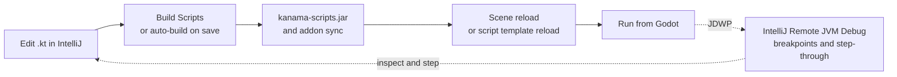

# The Editor Loop

Kanama projects can include two addons:

- `res://addons/kanama`: the runtime GDExtension addon loaded by Godot.
- `res://addons/kanama_tools`: an optional editor plugin for build and reload
  workflow shortcuts.

The tools plugin is not required at runtime. It exists to make the editor loop
less manual while developing Kotlin scripts.

When enabled, the plugin also registers a basic Kotlin syntax highlighter for
`.kt` files in Godot's script editor. This is intended for quick inspection and
small edits; IntelliJ IDEA remains the recommended editor for Kotlin navigation,
completion, refactoring, and debugging.



## Build Scripts

Enable `Kanama Tools` in **Project > Project Settings > Plugins** to add a
`Build Scripts` toolbar button and matching tool-menu action. The toolbar also
includes `Open Kotlin`, which opens the configured Kotlin source folder in the
operating system so you can jump back to IntelliJ IDEA or another external
editor workflow quickly.

For starter and external projects, `Build Scripts` runs:

```sh
./gradlew -p <kanama repo> installAddonJar \
  -PkanamaProjectDir=<current Godot project> \
  -PkanamaProjectScriptsDir=<current Godot project>
```

That command builds `kanama.jar`, builds the host native bootstrap with CMake,
compiles project Kotlin scripts into `kanama-scripts.jar`, copies the addon
files into `addons/kanama`, and ensures `.godot/extension_list.cfg` loads
`res://addons/kanama/kanama.gdextension`.

For the checked-in Kanama example project, the equivalent local command is:

```sh
./gradlew syncExampleAddonJar
```

## Project Settings

External projects may need to tell the plugin where the Kanama source checkout
lives:

```ini
[kanama]
tools/repo_dir="/absolute/path/to/kanama"
```

Useful editor settings:

| Setting | Purpose |
| --- | --- |
| `kanama/tools/kotlin_sources_dir` | Optional absolute or `res://` source folder opened by `Open Kotlin`. Empty defaults to the project root. |
| `kanama/tools/auto_build_on_save` | Watches `.kt` files and runs a debounced script build. |
| `kanama/tools/reload_scene_after_sync` | Reloads the current scene after a successful sync. |
| `kanama/tools/developer_mode` | Shows runtime build actions intended for Kanama maintainers. |

`Build Runtime` is hidden unless `developer_mode` is enabled. Normal game
projects should use `Build Scripts`; runtime rebuilds are mainly for Kanama
development.

## Debugging

The plugin registers the runtime/game JDWP settings:

```ini
[kanama]
debug/jdwp_enabled=true
debug/jdwp_port=5005
```

Restart the game process after changing either setting. Kanama reads these
settings before starting the embedded JVM. When launching from the Godot editor,
the editor process skips the runtime JDWP port so the spawned game process can
bind it.

Create an IntelliJ **Remote JVM Debug** run configuration for `localhost:5005`
or the configured port, then press Play in Godot and attach the debugger. You
can set breakpoints in Kotlin scripts and step through lifecycle callbacks,
signal handlers, and ordinary gameplay code while the game is running.

For one-off launches, `KANAMA_JDWP_PORT=5005` overrides the project setting.

## Script Reload

After a script sync, existing `KanamaScript` resources are rebound to the newest
template. Scene reload remains the most reliable editor workflow for live-node
replacement; enable `kanama/tools/reload_scene_after_sync` when that behavior is
preferred.

Reload support is for attachable `@ScriptClass` scripts loaded from
`kanama-scripts.jar`. Permanent `@RegisterClass` types are registered in
Godot's ClassDB and require an editor restart after changes.

For maintainer-level details and smoke scripts, see
[Hot Reload Internals](../contributing/hot-reload-internals.md).
