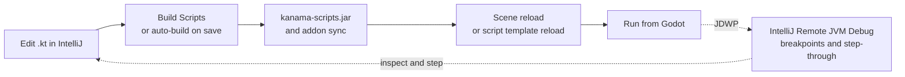

# The Editor Loop

Kanama projects can include two addons:

- `res://addons/kanama`: the runtime GDExtension addon loaded by Godot.
- `res://addons/kanama_tools`: an optional editor plugin for build and reload
  workflow shortcuts.

The tools plugin is not required at runtime. It exists to make the editor loop
less manual while developing Kotlin scripts.

When enabled, the plugin also registers a basic Kotlin syntax highlighter for
`.kt` files in Godot's script editor. This is intended for quick inspection and
small edits; IntelliJ IDEA remains the recommended editor for Kotlin navigation,
completion, refactoring, and debugging.

The plugin also checks desktop Java setup when it loads. Kanama needs a JDK 25+
distribution that contains `libjvm`. The check mirrors exactly what the native
runtime does to find it (same order, same install locations, same version rule;
see [Which JDK Kanama Uses](#which-jdk-kanama-uses)), so a Godot started without
`JAVA_HOME` does not warn while the runtime can find a JDK 25+, and warns when it
cannot. The warning names the `kanama/build/jdk_path` editor setting.


```mermaid
flowchart LR
    EDIT["Edit .kt in IntelliJ"]
    BUILD["Build Scripts<br/>or auto-build on save"]
    SYNC["kanama-scripts.jar<br/>and addon sync"]
    RELOAD["Scene reload<br/>or script template reload"]
    PLAY["Run from Godot"]
    DEBUG["IntelliJ Remote JVM Debug<br/>breakpoints and step-through"]

    EDIT --> BUILD --> SYNC --> RELOAD --> PLAY
    PLAY -. JDWP .-> DEBUG
    DEBUG -. inspect and step .-> EDIT
```

## Build Scripts

Enable `Kanama Tools` in **Project > Project Settings > Plugins** to add a
`Build Scripts` toolbar button and matching tool-menu action. The toolbar also
includes `Open Kotlin`, which opens the configured Kotlin source folder in the
operating system so you can jump back to IntelliJ IDEA or another external
editor workflow quickly.

For starter and external projects, `Build Scripts` runs:

```sh
./gradlew -p <kanama repo> installAddonJar \
  -PkanamaProjectDir=<current Godot project> \
  -PkanamaProjectScriptsDir=<current Godot project>
```

That command builds `kanama.jar`, builds the host native bootstrap with CMake,
compiles project Kotlin scripts into `kanama-scripts.jar`, copies the addon
files into `addons/kanama`, and ensures `.godot/extension_list.cfg` loads
`res://addons/kanama/kanama.gdextension`.

For the checked-in Kanama example project, the equivalent local command is:

```sh
./gradlew syncExampleAddonJar
```

## Which JDK Kanama Uses

Kanama uses a JDK in two places: **Build Scripts** runs Gradle (and, through it,
the CMake step that compiles the native bootstrap against the JDK's `jni.h`), and
the **runtime** loads that JDK's `libjvm` into Godot. Both need JDK 25 or newer.
On Linux and Windows, Godot started from a desktop launcher (an application menu
entry, a desktop shortcut, a file manager) does **not** inherit the `JAVA_HOME`
from your shell profile, so without help the system's default JDK, often an older
one, would be used. Both therefore pick the JDK the same way, in this order:

1. The **`kanama/build/jdk_path`** editor setting (empty means automatic). It is
   an *Editor Setting* (**Editor > Editor Settings > Kanama > Build**), stored
   per machine rather than in the project, so an absolute path is not committed
   with it. It must be an absolute path (`~/` is expanded), to the JDK's home
   directory: the folder that contains `bin/` and `lib/`. A wrong value is an
   error; it is never silently replaced by another JDK.
2. `JAVA_HOME` from the environment Godot was started with. One that points at a
   JDK older than 25 is skipped, not an error.
3. The best JDK found in the usual install locations. A JDK counts when its
   `release` file says 25 or newer. Among those, a GA release beats an
   early-access one, exactly 25 beats a newer major, then the newer version wins.

   | OS | Searched |
   | --- | --- |
   | Linux | `/usr/lib/jvm`, `/usr/lib64/jvm`, `/usr/java`, `/usr/local/java`, `/opt/java`, `/opt/jdk` |
   | macOS | `/Library/Java/JavaVirtualMachines/*/Contents/Home`, `~/Library/Java/JavaVirtualMachines/*/Contents/Home`, Homebrew `openjdk*` under `/opt/homebrew/opt` and `/usr/local/opt` |
   | Windows | `%ProgramFiles%\{Java, Eclipse Adoptium, Microsoft, Zulu, BellSoft, Amazon Corretto, Semeru, Temurin}`, Scoop `~\scoop\apps\*\current` |
   | All | `~/.jdks` (IntelliJ), `~/.sdkman/candidates/java` |

For **Build Scripts** the JDK must be a full JDK (it needs `include/jni.h`; a JRE
cannot compile the native bootstrap). The output panel names the JDK used
(`[kanama:tools] Build JDK: ... from ...`). If none qualifies, Build Scripts stops
with an error that names `kanama/build/jdk_path` and `JAVA_HOME` instead of
starting a build that fails inside the native compile.

The native **runtime** cannot read editor settings at load time, so the plugin
writes a valid `kanama/build/jdk_path` to `.godot/kanama_jdk_home` in the project
(and removes the file when the setting is empty or invalid), which the runtime
reads first. If that JDK has since been removed or is older than 25, the runtime
logs `[kanama] ignoring .godot/kanama_jdk_home=...` with the reason and continues
with `JAVA_HOME` and the install locations. The runtime reads the file once, when
Godot loads the extension, which is before the plugin can write it: on the first
open of a project (a fresh clone, or a deleted `.godot`) and after you change the
setting, the plugin warns **"Restart the editor to use JDK ..."** instead of
reporting OK. A game exported with a bundled runtime ignores all of this and uses
its own `runtime/` folder.

**Gradle itself** can run on any JDK 25+. The build pins its toolchain to JDK 25;
if only another JDK (a JDK 26-only machine, say) is installed, Gradle downloads a
JDK 25 once into `~/.gradle/jdks` and reuses it (the foojay toolchain resolver in
`settings.gradle.kts`, and in the release kit's `settings.gradle.kts`). That needs
network access the first time; install a JDK 25 to avoid the download. The
native bootstrap is compiled against that JDK 25 when Gradle runs the build.

Editors installed as a **Flatpak or Snap** run in a sandbox that cannot see
`/usr/lib/jvm` or your shell's `JAVA_HOME`. Grant the sandbox access to the JDK
folder (for Flatpak, `flatpak override --user --filesystem=<jdk dir>:ro`), point
`kanama/build/jdk_path` at a JDK inside a path the sandbox can read, or use the
unsandboxed Godot build. A shell build (`./gradlew ...`) is not affected: it
uses the shell's `JAVA_HOME`. The native bootstrap's CMake step checks, on every
OS, that the JDK it found has a `jni.h` that defines `JNI_VERSION_21` (a JDK 21
or newer header) and names the JDK when it does not.

## Project Settings

External projects may need to tell the plugin where the Kanama source checkout
lives:

```ini
[kanama]
tools/repo_dir="/absolute/path/to/kanama"
```

Projects created with `createStarterProject` do not include a Gradle wrapper.
In that case, **Build Scripts** runs `installAddonJar` from the Kanama source
checkout resolved through `kanama/tools/repo_dir` or the sibling checkout
autodetection. If a consumer project adds its own Gradle wrapper, the plugin
expects that project to provide a `buildScripts` task.

Useful editor settings:

| Setting | Purpose |
| --- | --- |
| `kanama/tools/kotlin_sources_dir` | Optional absolute or `res://` source folder opened by `Open Kotlin`. Empty defaults to the project root. |
| `kanama/tools/auto_build_on_save` | Watches `.kt` files and runs a debounced script build. |
| `kanama/tools/reload_scene_after_sync` | Reloads the current scene after a successful sync. |
| `kanama/tools/developer_mode` | Shows runtime build actions intended for Kanama maintainers. |
| `kanama/build/jdk_path` (Editor Setting) | JDK 25+ home directory (absolute) used by Build Scripts and the runtime. Empty tries `JAVA_HOME`, then the usual install locations. See [Which JDK Kanama Uses](#which-jdk-kanama-uses). |
| `kanama/tools/java_preflight_enabled` | Shows editor warnings when desktop `libjvm` cannot be found. |

`Build Runtime` is hidden unless `developer_mode` is enabled. Normal game
projects should use `Build Scripts`; runtime rebuilds are mainly for Kanama
development.

## Debugging

The plugin registers the runtime/game JDWP settings:

```ini
[kanama]
debug/jdwp_enabled=true
debug/jdwp_port=5005
```

Restart the game process after changing either setting. Kanama reads these
settings before starting the embedded JVM. When launching from the Godot editor,
the editor process skips the runtime JDWP port so the spawned game process can
bind it.

Create an IntelliJ **Remote JVM Debug** run configuration for `localhost:5005`
or the configured port, then press Play in Godot and attach the debugger. You
can set breakpoints in Kotlin scripts and step through lifecycle callbacks,
signal handlers, and ordinary gameplay code while the game is running.

For one-off launches, `KANAMA_JDWP_PORT=5005` overrides the project setting.
Other JVM options (a GC log, heap sizes) go in `KANAMA_JVM_OPTIONS`, for example
`KANAMA_JVM_OPTIONS="-Xlog:gc"`; see
[JVM Options](../exporting/desktop.md#jvm-options).

## Script Reload

After a script sync, existing `KanamaScript` resources are rebound to the newest
template. Scene reload remains the most reliable editor workflow for live-node
replacement; enable `kanama/tools/reload_scene_after_sync` when that behavior is
preferred.

Reload support is for attachable `@ScriptClass` scripts loaded from
`kanama-scripts.jar`. Permanent `@RegisterClass` types are registered in
Godot's ClassDB and require an editor restart after changes.

For maintainer-level details and smoke scripts, see
[Hot Reload Internals](../contributing/hot-reload-internals.md).
