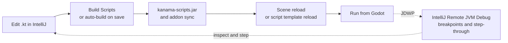

# The Editor Loop

Kanama projects can include two addons:

- `res://addons/kanama`: the runtime GDExtension addon loaded by Godot.
- `res://addons/kanama_tools`: an optional editor plugin for build and reload
  workflow shortcuts.

The tools plugin is not required at runtime. It exists to make the editor loop
less manual while developing Kotlin scripts.

When enabled, the plugin also registers a basic Kotlin syntax highlighter for
`.kt` files in Godot's script editor. This is intended for quick inspection and
small edits; IntelliJ IDEA remains the recommended editor for Kotlin navigation,
completion, refactoring, and debugging.

The plugin also checks desktop Java setup when it loads. Kanama needs a JDK 25+
distribution that contains `libjvm`. It uses the same JDK lookup as Build Scripts
([Which JDK Build Scripts Uses](#which-jdk-build-scripts-uses)), so a Godot
started without `JAVA_HOME` does not warn while a JDK 25+ can be found. If none
can, or the JDK found has no `lib/server/libjvm.*` file, the plugin shows a Godot
warning (naming `kanama/build/jdk_path`) before you hit a harder runtime failure.


```mermaid
flowchart LR
    EDIT["Edit .kt in IntelliJ"]
    BUILD["Build Scripts<br/>or auto-build on save"]
    SYNC["kanama-scripts.jar<br/>and addon sync"]
    RELOAD["Scene reload<br/>or script template reload"]
    PLAY["Run from Godot"]
    DEBUG["IntelliJ Remote JVM Debug<br/>breakpoints and step-through"]

    EDIT --> BUILD --> SYNC --> RELOAD --> PLAY
    PLAY -. JDWP .-> DEBUG
    DEBUG -. inspect and step .-> EDIT
```

## Build Scripts

Enable `Kanama Tools` in **Project > Project Settings > Plugins** to add a
`Build Scripts` toolbar button and matching tool-menu action. The toolbar also
includes `Open Kotlin`, which opens the configured Kotlin source folder in the
operating system so you can jump back to IntelliJ IDEA or another external
editor workflow quickly.

For starter and external projects, `Build Scripts` runs:

```sh
./gradlew -p <kanama repo> installAddonJar \
  -PkanamaProjectDir=<current Godot project> \
  -PkanamaProjectScriptsDir=<current Godot project>
```

That command builds `kanama.jar`, builds the host native bootstrap with CMake,
compiles project Kotlin scripts into `kanama-scripts.jar`, copies the addon
files into `addons/kanama`, and ensures `.godot/extension_list.cfg` loads
`res://addons/kanama/kanama.gdextension`.

For the checked-in Kanama example project, the equivalent local command is:

```sh
./gradlew syncExampleAddonJar
```

## Which JDK Build Scripts Uses

Build Scripts needs a JDK 25 or newer, both for Gradle and for the CMake step
that compiles the native bootstrap against that JDK's `jni.h`. On Linux and
Windows, Godot started from a desktop launcher (an application menu entry, a
desktop shortcut, a file manager) does **not** inherit the `JAVA_HOME` from your
shell profile, so without help the build would run on whatever JDK the system
treats as its default, which is often older. The plugin therefore picks the JDK
itself, in this order:

1. The project setting `kanama/build/jdk_path` (empty means automatic).
2. `JAVA_HOME` from the environment Godot was started with. One that points at
   a JDK older than 25 is skipped, not an error.
3. The newest JDK 25+ found in the usual install locations: `/usr/lib/jvm/*`
   on Linux, `/Library/Java/JavaVirtualMachines/*` on macOS, and the
   `C:\Program Files\{Java,Eclipse Adoptium,Microsoft,...}` folders on
   Windows, plus `~/.jdks` and `~/.sdkman/candidates/java`. The version is read
   from each JDK's `release` file.

The output panel names the JDK used (`[kanama:tools] Build JDK: ... from ...`).
If none of the three yields a JDK 25+, Build Scripts stops with an error that
names `kanama/build/jdk_path` and `JAVA_HOME` instead of starting a build that
fails inside the native compile. A `kanama/build/jdk_path` that is set but wrong
is also an error; it is never silently replaced by another JDK.

```ini
[kanama]
build/jdk_path="/usr/lib/jvm/temurin-25-jdk-amd64"
```

Set it to the JDK's home directory (the folder that contains `bin/` and
`lib/`). The setting is in **Project Settings > Kanama > Build** with
**Advanced Settings** on. A shell build (`./gradlew ...`) is not affected: it
uses the shell's `JAVA_HOME`, and the native bootstrap build checks that the JDK
it finds has a JDK 25 `jni.h`, on every OS, before compiling.

## Project Settings

External projects may need to tell the plugin where the Kanama source checkout
lives:

```ini
[kanama]
tools/repo_dir="/absolute/path/to/kanama"
```

Projects created with `createStarterProject` do not include a Gradle wrapper.
In that case, **Build Scripts** runs `installAddonJar` from the Kanama source
checkout resolved through `kanama/tools/repo_dir` or the sibling checkout
autodetection. If a consumer project adds its own Gradle wrapper, the plugin
expects that project to provide a `buildScripts` task.

Useful editor settings:

| Setting | Purpose |
| --- | --- |
| `kanama/tools/kotlin_sources_dir` | Optional absolute or `res://` source folder opened by `Open Kotlin`. Empty defaults to the project root. |
| `kanama/tools/auto_build_on_save` | Watches `.kt` files and runs a debounced script build. |
| `kanama/tools/reload_scene_after_sync` | Reloads the current scene after a successful sync. |
| `kanama/tools/developer_mode` | Shows runtime build actions intended for Kanama maintainers. |
| `kanama/build/jdk_path` | JDK 25+ home directory Build Scripts runs Gradle with. Empty tries `JAVA_HOME`, then the usual install locations. See [Which JDK Build Scripts Uses](#which-jdk-build-scripts-uses). |
| `kanama/tools/java_preflight_enabled` | Shows editor warnings when desktop `libjvm` cannot be found. |

`Build Runtime` is hidden unless `developer_mode` is enabled. Normal game
projects should use `Build Scripts`; runtime rebuilds are mainly for Kanama
development.

## Debugging

The plugin registers the runtime/game JDWP settings:

```ini
[kanama]
debug/jdwp_enabled=true
debug/jdwp_port=5005
```

Restart the game process after changing either setting. Kanama reads these
settings before starting the embedded JVM. When launching from the Godot editor,
the editor process skips the runtime JDWP port so the spawned game process can
bind it.

Create an IntelliJ **Remote JVM Debug** run configuration for `localhost:5005`
or the configured port, then press Play in Godot and attach the debugger. You
can set breakpoints in Kotlin scripts and step through lifecycle callbacks,
signal handlers, and ordinary gameplay code while the game is running.

For one-off launches, `KANAMA_JDWP_PORT=5005` overrides the project setting.

## Script Reload

After a script sync, existing `KanamaScript` resources are rebound to the newest
template. Scene reload remains the most reliable editor workflow for live-node
replacement; enable `kanama/tools/reload_scene_after_sync` when that behavior is
preferred.

Reload support is for attachable `@ScriptClass` scripts loaded from
`kanama-scripts.jar`. Permanent `@RegisterClass` types are registered in
Godot's ClassDB and require an editor restart after changes.

For maintainer-level details and smoke scripts, see
[Hot Reload Internals](../contributing/hot-reload-internals.md).
