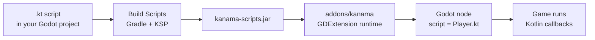

# Getting Started

This guide gets a desktop Godot project running with a Kotlin script attached
directly to a node.

## Requirements

- Godot 4.7 beta 2 from the
  [Godot 4.7 beta 2 archive](https://godotengine.org/download/archive/4.7-beta2/).
- JDK 25+ for desktop development and Gradle builds.
- CMake 3.22.1+ and a platform C toolchain for the desktop native bootstrap.
- A Kanama source checkout. The current preview installs addon artifacts from
  source instead of a published release package.

Android export is experimental and uses a separate Gradle/Android toolchain.
See [Android Experimental](../exporting/android.md) after the desktop workflow
is running.

## Platform Setup

Use the Godot binary for the platform you are testing. The current preview
validates source checkout, editor, runtime, and demo smoke workflows; packaged
desktop exports are tracked separately in
[Desktop and Packaging](../exporting/desktop.md).

| Platform | Setup notes |
| --- | --- |
| macOS arm64 | Install Temurin JDK 25 or another JDK 25 build, install CMake 3.22.1+ and Xcode command line tools, use `/Applications/Godot.app/Contents/MacOS/Godot` or a `PATH` entry for Godot, and run Gradle commands with `./gradlew`. This is the primary local maintainer workflow. |
| Windows x64 | Use the 4.7 beta 2 Windows console binary for smoke runs, install Temurin JDK 25, set `JAVA_HOME` so `%JAVA_HOME%\bin\server\jvm.dll` exists, install Visual Studio 2022 with **Desktop development with C++** for native bootstrap builds, and run Gradle commands in PowerShell with `.\gradlew.bat`. Git Bash smoke scripts are supported for marker checks. |
| Linux x64 | Install JDK 25, set `JAVA_HOME`, install CMake 3.22.1+, preflight `libkanama_bootstrap.so` with `file`, `ldd`, and `readelf` for release validation, set `XDG_DATA_HOME` to an isolated directory for repeatable headless/editor runs, and refresh demo addons with `installAddonJar`. |
| Linux ARM64 | Use the same Linux setup with the ARM64 Godot binary. Validation currently covers local runtime, editor, and demo smoke workflows; packaged desktop exports are tracked separately. |
| Android | Keep Android experimental. Use JDK 21 for Android Gradle/export tooling, Android SDK API 36 with build-tools 36.1.0 and NDK 29.0.14206865, matching Godot 4.7 beta 2 Android export templates, `installAndroidPluginAar`, and the emulator/Pixel 7 smoke path before updating release claims. |

Building Kanama from source does not require a Godot source checkout. The
desktop native bootstrap uses the GDExtension headers tracked in this
repository, JDK 25 headers, CMake, and the platform C toolchain.

## How Kanama Fits Into Godot



Kanama `.kt` files are Godot script resources. Attach them to compatible nodes
the same way you would attach a `.gd` script.

## 1. Install the Starter Files

Create or open a Godot project, then copy the starter template into it:

```sh
./gradlew installStarterTemplate \
  -PkanamaStarterProjectDir=/absolute/path/to/godot_project
```

The starter template adds `HelloScript.kt`, which is a minimal attachable
Kotlin script for a `Node2D`.

## 2. Build and Sync Kanama

From the Kanama checkout:

```sh
./gradlew installAddonJar \
  -PkanamaProjectDir=/absolute/path/to/godot_project \
  -PkanamaProjectScriptsDir=/absolute/path/to/godot_project
```

This builds the Kanama runtime and host native bootstrap, compiles the project
Kotlin scripts into `kanama-scripts.jar`, copies the addon into
`addons/kanama`, and registers the GDExtension in `.godot/extension_list.cfg`.

If your Kotlin scripts live outside the project root, point
`kanamaProjectScriptsDir` at that folder. For multiple roots, use
`-PkanamaProjectScriptsDirs=` with path-separated or comma-separated paths.

## 3. Attach the Script

1. Open the project in Godot.
2. Add a `Node2D` to a scene.
3. Attach `res://HelloScript.kt` to the node.
4. Run the scene.

`HelloScript.kt` prints a message from Kotlin when the node enters the scene.

## 4. Edit the Script

Kanama scripts are ordinary Kotlin files. Edit them in IntelliJ IDEA, then run
`installAddonJar` again after changes.

The starter script looks like this:

```kotlin
package com.example.game

import java.lang.foreign.MemorySegment
import net.multigesture.kanama.annotations.ClassName
import net.multigesture.kanama.annotations.Export
import net.multigesture.kanama.annotations.OnPhysicsProcess
import net.multigesture.kanama.annotations.OnReady
import net.multigesture.kanama.annotations.RegisterFunction
import net.multigesture.kanama.annotations.ScriptClass
import net.multigesture.kanama.annotations.Tool

@ScriptClass(attachTo = "Node2D")
@ClassName
@Tool
class HelloScript(val godotObject: MemorySegment) {
    @Export(hint = 1, hintString = "0,1000,1")
    var speed: Long = 120

    @OnReady
    fun ready() {
        System.err.println("[kanama:starter] HelloScript ready speed=$speed")
    }

    @OnPhysicsProcess
    fun physicsProcess(delta: Double) {
    }

    @RegisterFunction
    fun greet(name: String): String = "Hello $name from Kanama"
}
```

The constructor receives the Godot object handle. Higher-level examples in the
game development pages show typed `self` access, exported properties, signals,
and callbacks.

## 5. Enable the Editor Tools

The starter template includes:

```text
res://addons/kanama_tools
```

Enable **Kanama Tools** in Godot's plugin settings for a `Build Scripts`
toolbar button, `Open Kotlin` source-folder shortcut, optional build-on-save,
scene reload after sync, and JDWP debugging settings.

See [The Editor Loop](editor-workflow.md) for the build button, hot reload, and
IntelliJ debugger workflow.

## Source Install Notes

The current preview installs Kanama from a source checkout. See
[Desktop and Packaging](../exporting/desktop.md) for the full source-install
workflow, platform artifact notes, and packaging boundaries.

## What To Read Next

- [The Editor Loop](editor-workflow.md) for build buttons, hot reload, and
  debugging.
- [Writing Kotlin Scripts](../game-dev/scripts.md) for script structure,
  lifecycle callbacks, and `self`.
- [Exports and Resources](../game-dev/properties-resources.md) for inspector
  properties and node references.
- [Signals and Callbacks](../game-dev/signals.md) for Godot-style events.
