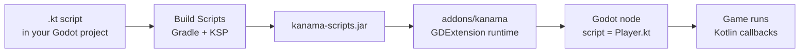

# Getting Started

Kanama's current public onboarding path is a source checkout. Packaged desktop
kits and store add-ons are buildable release artifacts, but they are download
flows only after matching GitHub zip artifacts are published.

| Path | Use it when | Start here |
| --- | --- | --- |
| Source checkout | You want to use Kanama today, use the current `main` branch, or validate a local Kanama change in your own project. | [Use a Source Checkout](source-checkout.md) |
| Release kit | You have a locally built or published desktop kit and want a small new Godot project without a sibling Kanama source checkout. | [Use a Release Kit](release-kit.md) |
| Store addon | You have a locally built or published store-addon zip and want to add Kanama to an existing Godot project without a sibling Kanama source checkout. | [Use a Store Addon](store-addon.md) |
| Contributor checkout | You want to work on Kanama runtime, wrappers, docs, native bootstrap, or release packaging. | [Work on Kanama](work-on-kanama.md) |

Android and iOS exports use their own toolchains; once the desktop workflow is
running, continue with [Android](../exporting/android.md) or
[iOS](../exporting/ios.md). Which platforms are Supported, and on what
evidence, is recorded in [Version Support](../reference/version-support.md).

## Requirements

The Godot release, JDK, host platforms, and per-workflow toolchains are listed
once, in [Version Support → Requirements](../reference/version-support.md#requirements).
In short: a desktop project needs the pinned Godot release and a JDK; a source
or contributor checkout additionally needs CMake and a C toolchain because it
builds the native bootstrap locally, while release kits and store add-ons ship
the prebuilt bootstrap.

## How Kanama Fits Into Godot

```mermaid
flowchart LR
    KT[".kt script<br/>in your Godot project"]
    BUILD["Build Scripts<br/>Gradle + KSP"]
    JAR["kanama-scripts.jar"]
    ADDON["addons/kanama<br/>GDExtension runtime"]
    NODE["Godot node<br/>script = Player.kt"]
    GAME["Game runs<br/>Kotlin callbacks"]

    KT --> BUILD --> JAR --> ADDON --> NODE --> GAME
```

Kanama `.kt` files are Godot script resources. Attach them to compatible nodes
the same way you would attach a `.gd` script. Kotlin changes must be compiled
with **Build Scripts** before Godot can run the updated behavior.

## What To Read Next

- [The Editor Loop](editor-workflow.md) for build buttons, hot reload, and
  debugging.
- [Writing Kotlin Scripts](../game-dev/scripts.md) for script structure,
  lifecycle callbacks, and `self`.
- [Calling Godot APIs](../game-dev/godot-api.md) for generated wrappers.
- [Exports and Resources](../game-dev/properties-resources.md) for inspector
  properties and node references.
- [Signals and Callbacks](../game-dev/signals.md) for Godot-style events.
